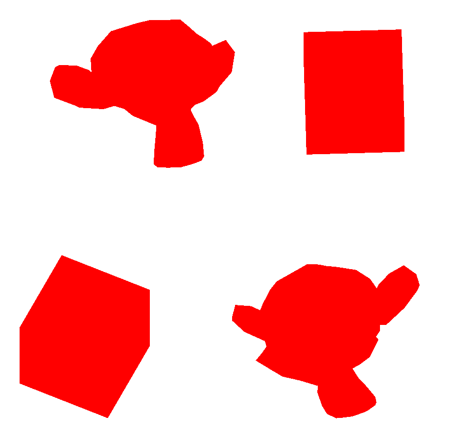

# Atividade Vivencial 01

Este diretório contém o projeto **Vivencial01**, desenvolvido para a **Atividade Presencial do Módulo 02** da disciplina de Computação Gráfica da Unisinos. O projeto demonstra a leitura de geometria a partir de arquivos **.OBJ**, a exibição de múltiplos objetos 3D na cena, seleção de objetos via teclado e aplicação de transformações (rotação, translação e escala) no objeto selecionado.

## 💡 Sobre o Programa

O projeto carrega modelos 3D (`Cube.obj` e `Suzanne.obj`) usando o loader `LoadSimpleOBJ.cpp`, que interpreta os dados do `.OBJ`, incluindo:

- vértices (`v`)
- coordenadas de textura (`vt`) - não utilizadas neste projeto
- normais (`vn`) - não utilizadas neste projeto
- índices das faces (`f`)

Os modelos são armazenados em uma lista (`vector<Object3D>`) e renderizados em tempo real com shaders básicos (sem texturas ou iluminação avançada). O programa permite selecionar objetos e aplicar transformações incrementais via teclado.

## 📁 Estrutura

- `src/Desafios/AV1/Vivencial01.cpp`
  - implementa a aplicação principal, incluindo inicialização de GLFW/GLAD, configuração de shaders, carregamento de modelos, gerenciamento de objetos e renderização.
- `Code snippets/LoadSimpleOBJ.cpp`
  - contém a função `loadSimpleOBJ(...)` que converte o arquivo `.OBJ` em um VAO para OpenGL.
- `assets/Modelos3D/Cube.obj`
  - modelo do cubo.
- `assets/Modelos3D/Suzanne.obj`
  - modelo da Suzanne.

## ⚙️ Como Executar

Para compilar e rodar este projeto, certifique-se de ter um compilador C++ e as bibliotecas necessárias instaladas (GLFW, GLAD, GLM). Você pode usar o Visual Studio Code, CLion, ou outro editor/IDE de sua preferência.

1. Abra o terminal e entre na pasta `build` do projeto: `cd build`
2. Gere os arquivos de build com o CMake (ou configure seu projeto na IDE).
3. Compile o projeto (pode utilizar `cmake --build .` no terminal).
4. Execute o programa gerado (`./Vivencial01`).

Certifique-se de que as DLLs das bibliotecas estejam acessíveis no PATH do sistema, se necessário.

## 🎮 Controles

- `TAB`: alterna entre os objetos instanciados (4 objetos: 2 cubes e 2 Suzannes).
- `X` / `Y` / `Z`: incrementa rotação nos eixos X, Y ou Z do objeto selecionado.
- `A` / `D` ou `←` / `→`: move o objeto selecionado no eixo X (esquerda/direita).
- `W` / `S`: move o objeto selecionado no eixo Z (aproxima/afasta).
- `I` / `J` ou `↑` / `↓`: move o objeto selecionado no eixo Y (cima/baixo).
- `[` / `]`: diminui / aumenta a escala uniforme do objeto selecionado.
- `ESC`: fecha o programa.

## 🖥️ Preview

> Exemplo da interface do projeto com múltiplos objetos 3D

## 📌 Observações Finais
- Os shaders são básicos (sem texturas ou iluminação) para foco nas transformações geométricas.
- O projeto pode ser expandido para suportar texturas, materiais completos e interações com mouse.