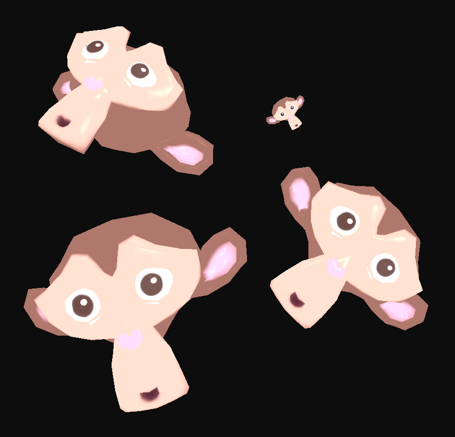
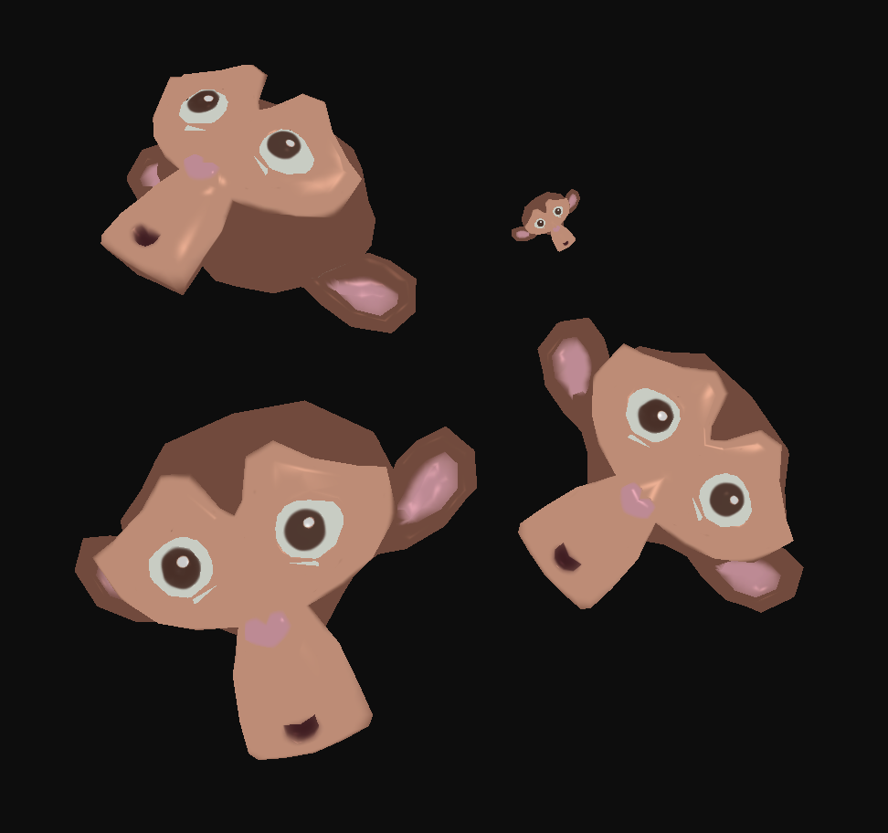

# Atividade Vivencial 02

Este diretório contém o projeto Atividade Vivencial 02, desenvolvido para a disciplina de Computação Gráfica da Unisinos. O projeto demonstra a aplicação de iluminação tridimensional utilizando o modelo de Phong combinado com a técnica de iluminação de três pontos (Three-Point Lighting), aplicada a modelos 3D carregados a partir de arquivos `.OBJ`, com materiais definidos em arquivos `.MTL` e texturização.

## 💡 Descrição

O projeto carrega o modelo 3D Suzanne a partir de um arquivo .OBJ, utilizando o loader LoadSimpleOBJ.cpp, responsável por interpretar:

- vértices (v)
- coordenadas de textura (vt)
- vetores normais (vn)
- índices das faces (f)

Além da geometria, o programa realiza a leitura do arquivo de materiais .MTL, recuperando:

- coeficiente ambiente (Ka)
- coeficiente difuso (Kd)
- coeficiente especular (Ks)
- textura difusa (map_Kd)

A iluminação da cena é calculada por meio do modelo de Phong, utilizando três fontes de luz:

- Key Light (luz principal)
- Fill Light (luz de preenchimento)
- Back Light (luz de recorte)

As luzes são posicionadas dinamicamente em torno do objeto selecionado, simulando um esquema clássico de iluminação utilizado em fotografia, cinema e renderização 3D. O usuário pode habilitar ou desabilitar cada luz individualmente, observando os efeitos produzidos sobre o modelo.

Além da iluminação, o programa permite selecionar objetos e aplicar transformações geométricas em tempo real por meio do teclado.

## 📁 Estrutura

- `src/Desafios/AV2/Vivencial02.cpp`
  - implementa a aplicação principal, incluindo inicialização de GLFW/GLAD, carregamento de modelos, materiais, texturas, configuração do modelo de Phong e sistema de iluminação de três pontos.
- `Code snippets/LoadSimpleOBJ.cpp`
  - contém a função `loadSimpleOBJ(...)` que converte o arquivo `.OBJ` em um VAO para OpenGL.
- `assets/Modelos3D/Suzanne.obj`
  - modelo 3D utilizado na cena.
- `assets/Modelos3D/Suzanne/Suzanne.mtl`
  - arquivo de materiais associado ao modelo.

## ⚙️ Como Executar

Para compilar e rodar este projeto, certifique-se de ter um compilador C++ e as bibliotecas necessárias instaladas (GLFW, GLAD, GLM). Você pode usar o Visual Studio Code, CLion, ou outro editor/IDE de sua preferência.

1. Abra o terminal e entre na pasta `build` do projeto: `cd build`
2. Gere os arquivos de build com o CMake (ou configure seu projeto na IDE).
3. Compile o projeto (pode utilizar `cmake --build .` no terminal).
4. Execute o programa gerado (`./Vivencial02`).

Certifique-se de que as DLLs das bibliotecas estejam acessíveis no PATH do sistema, se necessário.

## 🎮 Controles

- `TAB`: alterna entre os objetos instanciados (4 objetos: 2 cubes e 2 Suzannes).
- `X` / `Y` / `Z`: incrementa rotação nos eixos X, Y ou Z do objeto selecionado.
- `A` / `D` ou `←` / `→`: move o objeto selecionado no eixo X (esquerda/direita).
- `W` / `S`: move o objeto selecionado no eixo Z (aproxima/afasta).
- `I` / `J` ou `↑` / `↓`: move o objeto selecionado no eixo Y (cima/baixo).
- `[` / `]`: diminui / aumenta a escala uniforme do objeto selecionado.
- `1`: ativa/desativa a Key Light.
- `2`: ativa/desativa a Fill Light.
- `3`: ativa/desativa a Back Light.
- `ESC`: fecha o programa.

## 🖥️ Preview

> Exemplos da aplicação do modelo de Phong combinado com iluminação de três pontos, utilizando múltiplas instâncias do modelo Suzanne.

## 📌 Observações Finais
- O projeto demonstra a integração entre carregamento de modelos `.OBJ`, materiais `.MTL`, texturização e iluminação de Phong.
- Foi implementada uma configuração de iluminação de três pontos (Three-Point Lighting), composta por luz principal, luz de preenchimento e luz de recorte.
- As luzes acompanham dinamicamente o objeto selecionado, permitindo observar os efeitos da iluminação sob diferentes transformações geométricas.
- Cada fonte de luz pode ser habilitada ou desabilitada individualmente durante a execução da aplicação.