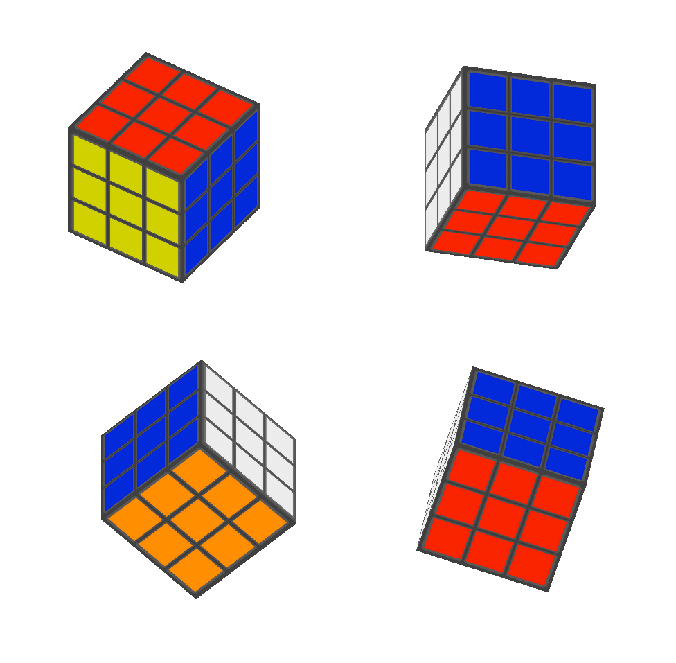

# Hello Textures 3D

Este diretório contém o projeto **HelloTextures3D**, desenvolvido para o **Módulo 03** da disciplina de Computação Gráfica da Unisinos. O projeto demonstra a leitura de geometria a partir do arquivo **Cube.obj**, a leitura do material **.mtl** para obtenção da textura associada e a aplicação de coordenadas de textura para renderização de objetos texturizados em OpenGL.

## 💡 Sobre o Programa

O projeto carrega um modelo 3D (`Cube.obj`) e sua textura associada definida em `Cube.mtl`. O loader `LoadSimpleOBJ.cpp` é utilizado para interpretar os dados do `.OBJ`, incluindo:

- vértices (`v`)
- coordenadas de textura (`vt`)
- normais (`vn`)
- índices das faces (`f`)

A textura é carregada por `stb_image` a partir do arquivo especificado em `map_Kd` no `.mtl`. Após o carregamento, os dados de geometria e textura são enviados para a GPU e processados por shaders para renderização em tempo real.

## 📁 Estrutura

- `src/Desafios/M3/HelloTextures3D.cpp`
  - implementa a aplicação principal, incluindo inicialização de GLFW/GLAD, configuração de shaders, carregamento de modelo e textura, e renderização.
- `Code snippets/LoadSimpleOBJ.cpp`
  - contém a função `loadSimpleOBJ(...)` que converte o arquivo `.OBJ` em um VAO para OpenGL.
- `assets/Modelos3D/Cube.obj`
  - modelo do cubo com coordenadas de textura.
- `assets/Modelos3D/Cube.mtl`
  - material do cubo que aponta para `cube_texture.png`.
- `assets/Modelos3D/cube_texture.png`
  - textura aplicada ao modelo 3D.

## ⚙️ Como Executar

Para compilar e rodar este projeto, certifique-se de ter um compilador C++ e as bibliotecas necessárias instaladas (GLFW, GLAD, GLM). Você pode usar o Visual Studio Code, CLion, ou outro editor/IDE de sua preferência.

1. Abra o terminal e entre na pasta `build` do projeto: `cd build`
2. Gere os arquivos de build com o CMake (ou configure seu projeto na IDE).
3. Compile o projeto (pode utilizar `cmake --build .` no terminal).
4. Execute o programa gerado (`./HelloTextures3D`).

Certifique-se de que as DLLs das bibliotecas estejam acessíveis no PATH do sistema, se necessário.

## 🎮 Controles

- `X` / `Y` / `Z`: alterna rotação nos eixos X, Y ou Z.
- `A` / `D`: move o cubo no eixo X (esquerda/direita).
- `W` / `S`: move o cubo no eixo Z (aproxima/afasta).
- `I` / `J`: move o cubo no eixo Y (cima/baixo).
- `[` / `]`: diminui / aumenta a escala uniforme do cubo.
- `TAB`: alterna entre os cubos instanciados.
- `ESC`: fecha o programa.

## 🖥️ Preview

[▶ Ver demonstração em vídeo](../../../assets/demos/DEMOHelloTextures3D.mp4)

> Exemplo da interface do projeto

## 📌 Observações Finais

- A compatibilidade entre o shader e o loader `.obj` depende do layout de atributos definido em `LoadSimpleOBJ.cpp`.
- O material `.mtl` é usado apenas para obter o nome da textura (`map_Kd`) neste projeto, não para carregar propriedades de iluminação completas.
- A implementação atual atende ao desafio de texturização básica e pode ser expandida para suportar múltiplos materiais, mapas normais e iluminação avançada.
