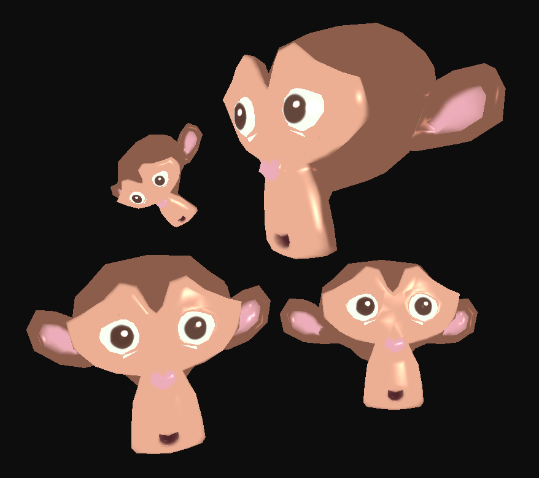

# HelloIllumination3D

Este diretório contém o projeto HelloIllumination3D, desenvolvido para o Módulo 04 da disciplina de Computação Gráfica da Unisinos. O projeto demonstra a aplicação do modelo de iluminação de Phong em objetos 3D carregados a partir de arquivos .OBJ, utilizando materiais definidos em arquivos .MTL, texturização e transformações geométricas interativas.

## 💡 Descrição

O projeto carrega o modelo 3D Suzanne a partir de um arquivo .OBJ, utilizando o loader LoadSimpleOBJ.cpp, responsável por interpretar:

- vértices (v)
- coordenadas de textura (vt)
- vetores normais (vn)
- índices das faces (f)

Além da geometria, o programa realiza a leitura do arquivo de materiais .MTL, recuperando:

- coeficiente ambiente (Ka)
- coeficiente difuso (Kd)
- coeficiente especular (Ks)
- textura difusa (map_Kd)

Os dados são enviados para os shaders e utilizados para calcular as componentes de iluminação ambiente, difusa e especular do modelo de Phong. O programa também permite selecionar objetos e aplicar transformações geométricas em tempo real por meio do teclado.

## 📁 Estrutura

- `src/Desafios/M4/HelloIllumination3D.cpp`
  - implementa a aplicação principal, incluindo inicialização de GLFW/GLAD, configuração de shaders, carregamento de modelos, leitura de materiais, texturas e renderização.
- `Code snippets/LoadSimpleOBJ.cpp`
  - contém a função `loadSimpleOBJ(...)` que converte o arquivo `.OBJ` em um VAO para OpenGL.
- `assets/Modelos3D/Suzanne.obj`
  - modelo 3D utilizado na cena.
- `assets/Modelos3D/Suzanne/Suzanne.mtl`
  - arquivo de materiais associado ao modelo.

## ⚙️ Como Executar

Para compilar e rodar este projeto, certifique-se de ter um compilador C++ e as bibliotecas necessárias instaladas (GLFW, GLAD, GLM). Você pode usar o Visual Studio Code, CLion, ou outro editor/IDE de sua preferência.

1. Abra o terminal e entre na pasta `build` do projeto: `cd build`
2. Gere os arquivos de build com o CMake (ou configure seu projeto na IDE).
3. Compile o projeto (pode utilizar `cmake --build .` no terminal).
4. Execute o programa gerado (`./HelloIllumination3D`).

Certifique-se de que as DLLs das bibliotecas estejam acessíveis no PATH do sistema, se necessário.

## 🎮 Controles

- `TAB`: alterna entre os objetos instanciados (4 objetos: 2 cubes e 2 Suzannes).
- `X` / `Y` / `Z`: incrementa rotação nos eixos X, Y ou Z do objeto selecionado.
- `A` / `D` ou `←` / `→`: move o objeto selecionado no eixo X (esquerda/direita).
- `W` / `S`: move o objeto selecionado no eixo Z (aproxima/afasta).
- `I` / `J` ou `↑` / `↓`: move o objeto selecionado no eixo Y (cima/baixo).
- `[` / `]`: diminui / aumenta a escala uniforme do objeto selecionado.
- `ESC`: fecha o programa.

## 🖥️ Preview

> Exemplo da aplicação do modelo de iluminação de Phong com texturização e múltiplas instâncias do modelo Suzanne.

## 📌 Observações Finais
- O projeto demonstra a integração entre carregamento de modelos `.OBJ`, materiais `.MTL`, texturização e iluminação de Phong.
- As transformações geométricas podem ser aplicadas individualmente aos objetos da cena através do teclado.