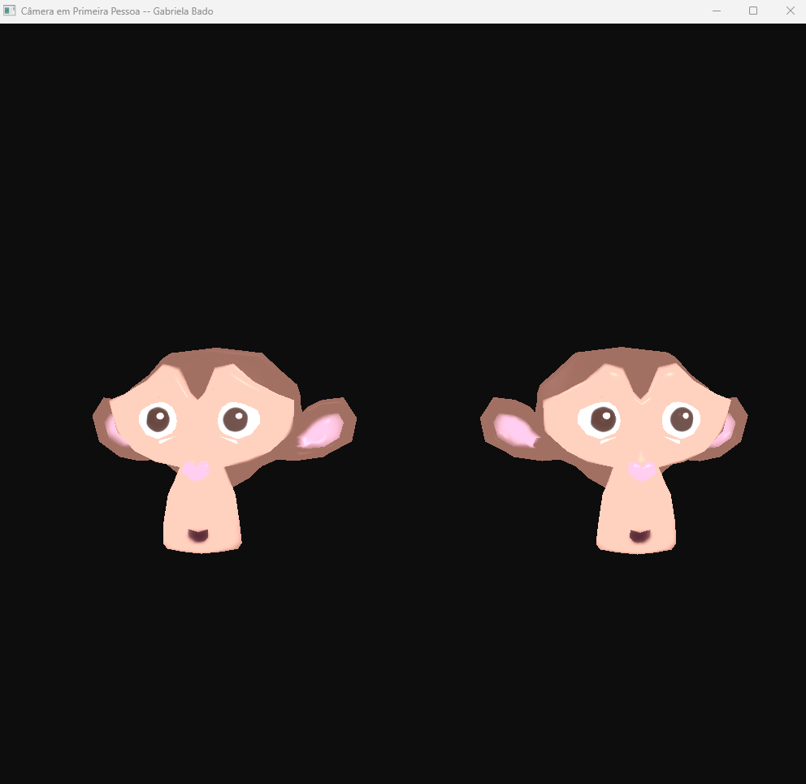

# Object Trajectories

Este diretório contém o projeto Object Trajectories, desenvolvido para a disciplina de Computação Gráfica da Unisinos. O projeto demonstra a implementação de trajetórias cíclicas para objetos 3D em uma cena OpenGL, combinando câmera em primeira pessoa, carregamento de modelos `.OBJ`, materiais definidos em arquivos `.MTL`, texturização e iluminação baseada no modelo de Phong com a técnica de Three-Point Lighting.

## 💡 Descrição

O projeto carrega o modelo 3D Suzanne a partir de um arquivo `.OBJ`, utilizando o loader `LoadSimpleOBJ.cpp`, responsável por interpretar:

- vértices (`v`)
- coordenadas de textura (`vt`)
- vetores normais (`vn`)
- índices das faces (`f`)

Além da geometria, o programa realiza a leitura do arquivo de materiais `.MTL`, recuperando:

- coeficiente ambiente (`Ka`)
- coeficiente difuso (`Kd`)
- coeficiente especular (`Ks`)
- textura difusa (`map_Kd`)

A cena é composta por duas instâncias do modelo Suzanne renderizadas simultaneamente.

Cada objeto possui uma trajetória independente, definida por uma lista de pontos de controle carregados a partir de arquivos externos (`.txt`). Quando ativada, a trajetória faz com que o objeto se mova continuamente entre os pontos definidos, repetindo o percurso de forma cíclica.

A iluminação é calculada através do modelo de Phong, utilizando três fontes de luz:

- Key Light (luz principal)
- Fill Light (luz de preenchimento)
- Back Light (luz de recorte)

As luzes são posicionadas dinamicamente em torno do objeto selecionado, permitindo visualizar os efeitos produzidos por cada componente da iluminação.

## 📁 Estrutura

- `src/Desafios/M5/FirstPersonCamera.cpp`
  - implementação principal da aplicação, incluindo inicialização de GLFW/GLAD, carregamento de modelos, texturas, materiais, câmera em primeira pessoa e sistema de iluminação.
- `Code snippets/LoadSimpleOBJ.cpp`
  - contém a função `loadSimpleOBJ(...)` que converte o arquivo `.OBJ` em um VAO para OpenGL.
- `assets/Modelos3D/Suzanne.obj`
  - modelo 3D utilizado na cena.
- `assets/Modelos3D/Suzanne/Suzanne.mtl`
  - arquivo de materiais associado ao modelo.
- `assets/objectTrajectory1.txt`
  - pontos de controle da trajetória do primeiro objeto.
- `assets/objectTrajectory2.txt`
  - pontos de controle da trajetória do segundo objeto.

## ⚙️ Como Executar

Para compilar e rodar este projeto, certifique-se de ter um compilador C++ e as bibliotecas necessárias instaladas (GLFW, GLAD, GLM). Você pode usar o Visual Studio Code, CLion, ou outro editor/IDE de sua preferência.

1. Abra o terminal e entre na pasta `build` do projeto: `cd build`
2. Gere os arquivos de build com o CMake (ou configure seu projeto na IDE).
3. Compile o projeto (pode utilizar `cmake --build .` no terminal).
4. Execute o programa gerado (`./ObjectTrajectories`).

Certifique-se de que as DLLs das bibliotecas estejam acessíveis no PATH do sistema, se necessário.

## 🎮 Controles

### Câmera
- `W` : move a câmera para frente
- `A` : move a câmera para esquerda
- `S` : move a câmera para trás
- `D` : move a câmera para direita
- `Mouse` : Controla a direção da câmera
- `Clique Esquerdo` : Captura o cursor
- `Clique Direito` : Libera o cursor
- `ESC`: fecha o programa.

### Objetos
- `TAB`: alterna entre os objetos instanciados.
- `←` / `→`: move o objeto selecionado no eixo X (esquerda/direita).
- `↑` / `↓`: move o objeto selecionado no eixo Y (cima/baixo).
- `X` / `Y` / `Z`: rotação nos eixos X, Y ou Z do objeto selecionado.
- `[` / `]`: diminui / aumenta a escala uniforme do objeto selecionado.
- `T` : ativa/desativa a trajetória do objeto atualmente selecionado

### Iluminação
- `1`: ativa/desativa a Key Light.
- `2`: ativa/desativa a Fill Light.
- `3`: ativa/desativa a Back Light.

## 🖥️ Preview

[▶ Ver demonstração em vídeo](../../../assets/demos/DEMOFirstPersonCamera.mp4)

> Exemplo de navegação em primeira pessoa

## 📌 Observações Finais

- Implementação de câmera em primeira pessoa utilizando matrizes de visualização (`glm::lookAt`).
- Controle de orientação através do movimento do mouse (Yaw/Pitch).
- Movimentação livre na cena utilizando o teclado.
- Carregamento de modelos `.OBJ` e materiais `.MTL`.
- Aplicação de texturas utilizando `stb_image`.
- Implementação do modelo de iluminação de Phong.
- Configuração de iluminação de três pontos (Key, Fill e Back Light).
- Possibilidade de transformar os objetos em tempo real através do teclado.
- Ativação e desativação individual das fontes de luz durante a execução.
- Implementação de trajetórias independentes para múltiplos objetos.
- Leitura de pontos de controle a partir de arquivos externos.
- Movimentação automática dos objetos ao longo de trajetórias cíclicas.
- Ativação e desativação das trajetórias durante a execução.